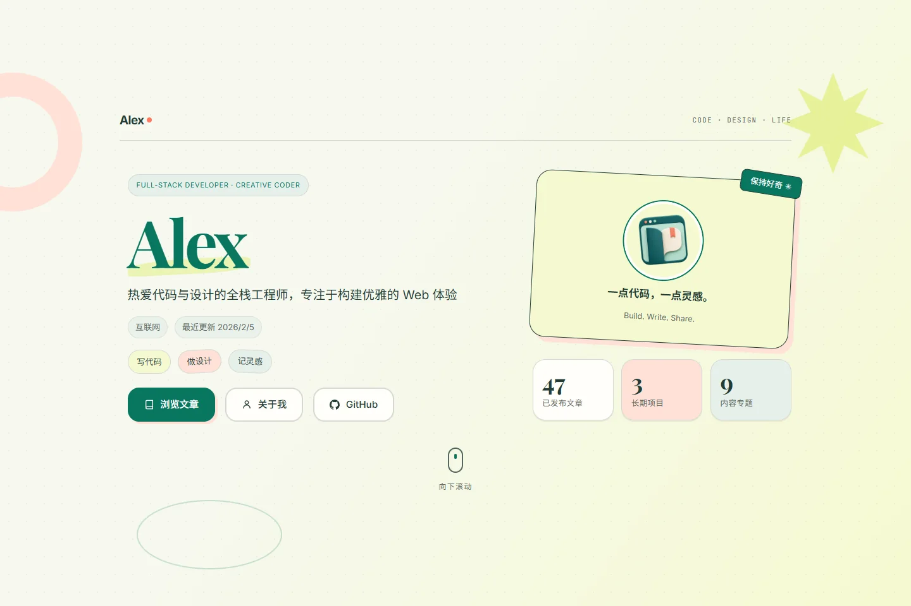

# Verdant

一个给 [Mintfolio](https://github.com/MintfolioBlog/mintfolio) 使用的个人主页与博客主题。

Verdant 保留了宽松的留白、文章卡片和绿色主色，也提供其他七套配色。主页可以放资料、项目与推荐文章；阅读页提供目录、代码复制、图片预览和阅读进度。

## 安装

先按 [入门教程](https://github.com/MintfolioBlog/mintfolio/wiki/Getting-Started) 建好站点，再在站点目录运行：

~~~sh
mintfolio theme install verdant --use
mintfolio dev
~~~

Verdant 0.3 需要 Core >= 0.3.0，使用 Theme API 1.1 的分页、独立页面与全文搜索。

Verdant 的 npm 包名是 @mintfolio/theme-verdant，清单 id 为 verdant。命令行可使用 verdant 简写。

## 调整主题

显示设置写在站点 theme.config.mjs 的 settings 中。运行 mintfolio theme use verdant 时，Core 会写入带注释的完整模板；之后升级主题不会改动你的设置。

~~~js
export default {
  theme: '@mintfolio/theme-verdant',
  settings: {
    initialMode: 'auto',
    initialPalette: '1',
    homePageSize: 6,
    sidebar: {
      quote: { enabled: true, text: '慢慢写，也认真读。', author: '' },
    },
  },
};
~~~

initialPalette 使用字符串 '1' 到 '8'。访客在浏览器中保存的配色偏好优先于初始值。网站标题、头像和项目内容放在 site.config.ts；侧栏、推荐文章和文末插图放在主题设置中。

全部选项见 [设置模板](config/theme-verdant.config.mjs) 与 [主题配置教程](https://github.com/MintfolioBlog/mintfolio/wiki/Themes)。未填写的字段使用默认值；对象递归合并，数组整体替换。

部署到 Astro `base` 指定的子目录时，推荐文章图片、文末插图及推荐工具的站内根路径（例如 `/images/footer.webp`）会自动加上该前缀；已经带前缀的路径不会重复处理，外部 URL 保持原样。文章、菜单和头像地址直接使用 Core 提供的结果。

## 页面与资源

主题提供首页、文章、归档和普通页面。404 页面由 Core 补齐。首页和普通页面会显示 site.config.ts 顶层的 icp 字段；其他页面目前未统一显示备案信息。

字体与图标随包分发。React 和 Tailwind 在启用本主题时由 Core 加载。文章读取、URL、搜索和解锁逻辑使用 Core 公共 API。

文章卡片、首页动态和详情日期使用站点的 `language` 与 `blog.timezone`（默认 `UTC`），不会随构建机器的本地时区变化。当前 Core 在构建时为 Markdown 表格生成可聚焦的横向滚动区域，因此公开文章关闭 JavaScript 后仍可阅读宽表格；用 Tab 聚焦后可按左右方向键滚动。Verdant 保留正文表格、代码块的局部滚动条；脚本只补充旧版 Core 的表格容器，并复用解锁正文已有的容器。密码文章的解锁仍需要 JavaScript。

## 修改源码

~~~sh
git clone https://github.com/MintfolioBlog/mintfolio-theme-verdant.git
cd mintfolio-theme-verdant
npm ci
npm run check
npm pack
~~~

将打出的 tgz 安装到测试站点，检查桌面、手机和密码文章页面。定制请保存在自己的主题仓库中，直接修改 node_modules 会在重新安装后丢失。

[主题开发教程](https://github.com/MintfolioBlog/mintfolio/wiki/Theme-Development) · [贡献说明](CONTRIBUTING.md) · [安全问题](SECURITY.md)

## 许可证

代码为 [GPL-3.0-only](LICENSE)。Inter、JetBrains Mono、Playfair Display 按 SIL OFL 1.1 分发，原始声明保存在 [licenses](licenses) 中。

静态分页大小在 `site.config.ts` 的 `blog.pageSize` 设置；旧 `archivePageSize` 配置保留读取兼容，已不影响分页。站点导航来自 Core，独立 Markdown 页面、文章元数据、系列及相关文章无需重复配置主题。

## 0.3.0 发行

主题包与 manifest 统一为 0.3.0，依赖 Mintfolio Core ^0.3.0。可使用 npm install @mintfolio/theme-verdant@0.3.0 安装，随后使用 mintfolio theme use @mintfolio/theme-verdant 切换。

## Google Analytics 迁移

统计已迁到 Core。删除 theme.config.mjs 或 theme-verdant.config.mjs 中的 analyticsId，并在 site.config.ts 中配置 analytics: { google: { measurementId: 'G-XXXXXXXXXX' } }。新版主题不再加载 gtag.js；应与包含本次迁移的 Core/Theme API 一同更新。统计默认只在生产构建生效，客户端导航使用 GA4 的历史变化增强型衡量，不要额外发送手动 page_view。

## 0.4.0

更新首页、归档、文章和独立页面布局，新增推荐文章轮播与社交图标，调整八套配色和正文样式。支持 Core 0.4；新版配置与统计迁移方式适用于 Core 0.4。
